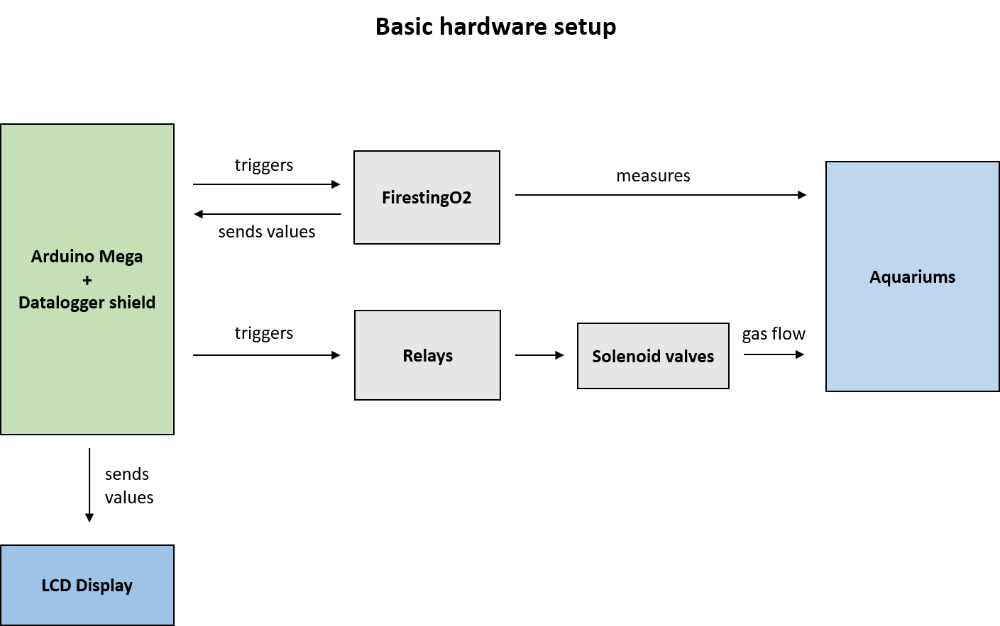

# Ardoxy
An Arduino library for interfacing with PyroScience FireSting oxygen meters.

## Use Cases
* measurement and logging of dissolved oxygen (DO) concentration and temperature
* automated control of DO concentration via solenoid valves or mass-flow controller
* establishment of pre-defined DO regime in fish tanks
* long-term acclimation to controlled DO conditions

## Project Status
This project is published and actively maintained.

## Citation
If you use Ardoxy in your research, please cite the following article:

Mucha, S. (2025). A microcontroller-based system for flexible oxygen control in laboratory experiments. *Journal of Experimental Biology*, 228(1), jeb249207. https://doi.org/10.1242/jeb.249207

[Read the article](https://journals.biologists.com/jeb/article/228/1/jeb249207/364933/A-microcontroller-based-system-for-flexible-oxygen)

## Published Use Cases

Studies that have used Ardoxy or its predecessor sketches:

* Pereira BP, Neff S, Borges FO, Otjacques E, Barreto G, Ranucci M, Court M, Rosa R, Repolho T, Paula JR (2024). Transgenerational exposure to deoxygenation and warming disrupts mate detection in *Gammarus locusta*. *Behavioral Ecology*, 35(1), arad102. https://doi.org/10.1093/beheco/arad102
* Gomes M, Lopes VM, Mai MG, Paula JR, Bispo R, Batista H, Barraca C, Baylina N, Rosa R, Pimentel MS (2023). Impacts of acute hypoxia on the short-snouted seahorse metabolism and behaviour. *Science of The Total Environment*, 904, 166893. https://doi.org/10.1016/j.scitotenv.2023.166893
* Court M, Macau M, Marquês T, et al. (2026). Low oxidative stress of cephalopod early life stages under chronic and intermittent hypoxia. *Marine Biology*, 173, 37. https://doi.org/10.1007/s00227-025-04779-1
* Remédios B, Gomes M, Costa F, Vasconcelos RO, Rosa R, Pimentel MS (2025). Physiological and behavioral responses of seahorse newborns to acute hypoxia. *Marine Environmental Research*, 211, 107344. https://doi.org/10.1016/j.marenvres.2025.107344
* Pereira BP, Oliveira R, Martins MD, Rosa R, Paula JR (2026). Ocean deoxygenation and warming disrupt cooperation in coral reef fish mutualisms. *Behavioral Ecology*, 37(2), araf152. https://doi.org/10.1093/beheco/araf152

## Table of Contents
* [Citation](#citation)
* [Published Use Cases](#published-use-cases)
* [Two Approaches](#two-approaches)
* [Ardoxy-OS](#ardoxy-os)
  * [Requirements](#requirements)
  * [Installation](#installation)
  * [Live Mode](#live-mode)
  * [Standalone Mode](#standalone-mode)
* [Dedicated Example Sketches](#dedicated-example-sketches)
  * [Example 1: measure\_DO](#example-1-measure_do)
  * [Example 2: setpoint\_solenoid](#example-2-setpoint_solenoid)
  * [Python Sketch Builder](#python-sketch-builder)
* [Background](#background)
* [Long-Term Oxygen Control: Basic Setup](#long-term-oxygen-control-basic-setup)
  * [List of Materials](#list-of-materials)
  * [Details](#details)
    * [Oxygen Sensor](#oxygen-sensor)
    * [Computing Component](#computing-component)
    * [Gas Flow Control](#gas-flow-control)
      * [Solenoid Valves](#solenoid-valves)
      * [Mass-Flow Controllers](#mass-flow-controllers)
  * [Overview](#overview)

## Two Approaches

Ardoxy offers two complementary ways to use the system, depending on how much control and flexibility you need:

| | **Ardoxy-OS** | **Dedicated sketches** |
|---|---|---|
| Arduino upload | Once | Once per experiment type |
| Configuration | Python GUI at runtime | Edit constants in the sketch before upload |
| Best for | Rapid setup, switching modes without re-uploading | Customised experiments, offline/standalone use |
| Status | Stable | Stable |

---

## Ardoxy-OS

Ardoxy-OS replaces sketch-editing with runtime configuration: upload one sketch, then configure and run experiments from a Python GUI without touching the Arduino code again. It comes in two modes, both driven by the same GUI application:

* **Live mode** (`examples/ardoxy_live/ardoxy_live.ino`) — the Arduino stays connected to a PC for the whole experiment. Best for short/medium runs where live monitoring is useful.
* **Standalone mode** (`examples/ardoxy_standalone/ardoxy_standalone.ino` or `examples/ardoxy_standalone_20x4lcd/ardoxy_standalone_20x4lcd.ino`) — the PC is only needed to configure the experiment; the Arduino then runs autonomously with SD card logging, RTC-scheduled start times, and an LCD status display. Supports up to 8 channels across two FireStingO2 sensors, each channel configured and scheduled independently.

### Requirements

**Arduino side**
* Arduino Uno (Live mode) or Arduino Mega with Adafruit Datalogger Shield + RTC (Standalone mode)
* [Arduino IDE](https://www.arduino.cc/en/software)
* Arduino libraries (install via the IDE Library Manager):
  * `Ardoxy` (this library)
  * `PID` by Brett Beauregard
  * Standalone mode only: `SdFat`, `RTClib`, and either `Adafruit_RGBLCDShield` (16×2 LCD, `ardoxy_standalone`) or the 20×4 LCD library used by `ardoxy_standalone_20x4lcd`

**PC side**
* Python 3.9 or later
* Dependencies listed in [`utils/ardoxy_gui/requirements.txt`](./utils/ardoxy_gui/requirements.txt):

```
pyserial
matplotlib
```

### Installation

1. **Install the Ardoxy library.** Clone or download this repository and copy the `Ardoxy` folder into your Arduino libraries directory (Windows default: `Documents\Arduino\libraries`).

2. **Install Python dependencies.**
   ```
   pip install -r utils/ardoxy_gui/requirements.txt
   ```

3. **Upload the sketch.** Open `examples/ardoxy_live/ardoxy_live.ino` (Live mode) or the appropriate `ardoxy_standalone` variant (Standalone mode) in the Arduino IDE, select your board and port, and upload. This only needs to be done once.

4. **Connect hardware.** Wire the FireSting oxygen meter(s) to the Arduino as described in the sketch header comments. Connect relay modules to the digital output pins you intend to use for valve control.

### Live Mode

```
python utils/ardoxy_gui/ardoxy_gui.py
```
Choose *Live Experiment* from the launcher. The GUI opens with three tabs:

**Connect** — select the COM port of your Arduino and click *Connect*. The Arduino state (`IDLE`, `CONFIGURED`, `RUNNING`) is displayed here.

**Configure** — choose a mode, set the number of channels, assign relay pins, and enter timing and control parameters. Click *Send Config to Arduino* to transfer the configuration. The Arduino does not start measuring until you explicitly click Start.

**Run & Monitor** — click *Start* to begin. A live chart shows DO (% air saturation) per channel and temperature. A data table shows the last 200 readings. Click *Save CSV* at any time to export all accumulated data. Click *Stop* to halt the run; the configuration is preserved and the run can be resumed with *Start* again.

#### Modes

| Mode | Description |
|---|---|
| **MEASURE** | Continuous DO and temperature measurement. No valve control. Runs until *Stop* is pressed. |
| **SETPOINT** | PID-controlled solenoid valve(s) maintain DO at a single target value for a defined duration. |
| **SEQUENCE** | Multi-phase experiment. Each phase is a *hold* (maintain a setpoint), *change* (ramp to a new setpoint), or *pause* (valves closed). Phases are defined in the GUI table. |

### Standalone Mode

```
python utils/ardoxy_gui/ardoxy_gui.py
```
Choose *Standalone Experiment* from the launcher. Unlike Live mode, each of the up to 8 channels is configured, scheduled, and run independently:

* Assign relay pins, PID gains, and a short tank ID per channel.
* Set each channel's mode (MEASURE, SETPOINT, or SEQUENCE) and, optionally, a specific start date/time — channels can start immediately or at a scheduled time in the future.
* Once configured, save the config to the Arduino's SD card and disconnect the PC — the Arduino runs the experiment autonomously, logging to CSV files on the SD card and showing status on the LCD.
* If power is lost mid-experiment, the Arduino automatically resumes from `STATE.TXT` on the SD card on reboot.
* Reconnect the GUI at any time to check status, read back the saved configuration, or download log files from the SD card.

For the full serial command reference shared by Live and Standalone mode, see [`docs/PROTOCOL.md`](./docs/PROTOCOL.md).

---

## Dedicated Example Sketches

These sketches are standalone Arduino programs. Each covers one specific use case and is designed to be read, understood, and modified directly. They are the most straightforward path if you want to customise the control logic or run the Arduino without a PC.

**General setup for all sketches:**
1. Gather components: an Arduino (Uno or Mega), a FireSting oxygen meter with sensors, jumper cables and a 7-pin connector (e.g. [Phoenix contact PTSM 0,5/ 7-P-2,5 - 1778887](https://www.phoenixcontact.com/en-ca/products/pcb-plug-ptsm-05-7-p-25-1778887)).
2. Set up and calibrate the oxygen meter using the PyroScience Workbench software ([download](https://www.pyroscience.com/en/downloads/laboratory-devices?file=files/website_data/Downloads/Software/InstallerPyroWorkbench.zip&cid=17724)).
3. Install the [Arduino IDE](https://www.arduino.cc/en/software).
4. Install the Ardoxy library (see [Installation](#installation) above) and open an example from *File → Examples → Ardoxy*.
5. Edit the configuration constants at the top of the sketch, then upload.

### Example 1: measure_DO
Sends temperature and DO measurements via serial to the PC. To plot these values, [download SerialPlot](https://hackaday.io/project/5334-serialplot-realtime-plotting-software) and load the settings file from this repo ([link](./utils/SerialPlotter%20config%20measure%20and%20plot.ini)). This software allows you to send commands (to trigger the start of measurements) and to visualize and log values.


### Example 2: setpoint_solenoid
Controls DO via solenoid valves connected to a relay module. Measured values are sent to the computer via serial and can be plotted (as above) or logged, e.g., using [ExtraPuTTY](https://sourceforge.net/projects/extraputty/). The Arduino opens the valves to allow gas flow (nitrogen or air/oxygen) to regulate DO to a defined setpoint for a defined duration.

Additional dedicated sketches cover:
* `setpoint_motor` — setpoint control via a stepper motor driving a needle valve
* `sequence_solenoid` — multi-phase sequence control with solenoid valves
* `sequence_motor` — multi-phase sequence control with a stepper motor
* `standalone_solenoid` — fully autonomous 4-channel control with SD card logging, RTC, and LCD display (no PC required)
* `standalone_solenoid_8ch` — same as above, but across 8 channels using two FireStingO2 sensors
* `manual_communication_uno` / `manual_communication_mega` — bypass the Ardoxy library entirely and relay raw serial commands to the FireSting via the Serial Monitor; useful for testing sensor wiring/calibration or exploring the FireSting communication protocol directly

> **Note:** `standalone_solenoid` and `standalone_solenoid_8ch` require editing constants and re-uploading for every new experiment. For SD/RTC/LCD-based autonomous logging *without* re-uploading between experiments, use [Standalone Mode](#standalone-mode) instead.

### Python Sketch Builder
The [Python Sketch Builder](./utils/Single%20Setpoint%20Sketch%20Builder.py) is a GUI tool that generates a ready-to-upload `setpoint_solenoid`-style sketch with user-defined parameters (setpoint, PID gains, pins, timing) for 1–4 channels, without editing code manually.


## Background
Oxygen is a limited but essential resource for aquatic life. In many ecosystems, dissolved oxygen fluctuates and can reach critically low concentrations - a condition called hypoxia. Fish that have evolved under the pressure of aquatic hypoxia have developed many adaptations, ranging from behavioral strategies and morphology (-> gills!) to biochemical and physiological adjustments. These adaptations secure their survival under hypoxic conditions. For the research of these adaptations, it is advantageous if one can reproduce long term hypoxia (as it occurs naturally) in the lab.

A simple way to reproduce hypoxic conditions is to bubble nitrogen gas into water. The nitrogen displaces dissolved oxygen but remains otherwise inert - it does not react with the water. Hypoxic conditions, however, need to be closely monitored and controlled. Thus, periodic measurements and adjustments of oxygen levels are mandatory to create safe and reproducible conditions.

This project aims to create the basis for an open and reproducible oxygen control system on which interested researchers and afficionados can improve and develop their own systems. It is part of my PhD research on the behavior and physiology of weakly electric fish and I'm not a pro when it comes to pneumatic, kybernetics and electrotechnics (actually, I learned everything that I needed over the course of a couple of months). This means that
1. This system can still be improved
2. You can build it, even if you didn't go through an education in technical kybernetics

Here are the minimal requirements that I wanted to fulfill with this system:
* long-term measurement and logging of dissolved oxygen and temperature
* reproducible control of dissolved oxygen via nitrogen influx
* open and reproducible design
* affordability

## Long Term Oxygen Control: Basic Setup
*All components here are listed for reproduction purposes and not as advertisement!*

### List of Materials
These are the core components of the oxygen measurement and control system. For details, see below
* Oxygen sensor: PyroScience FireStingO2
* Logging, computation, control: Arduino Mega
* Gas flow control: Solenoid valves or Mass-flow controllers

### Details
#### Oxygen Sensor
As this system is intended for long-term use, it relies on optical oxygen sensors. Optical sensors constitute the most expensive component - they are much more expensive than the relatively cheap electrochemical oxygen electrodes (such as [silver-platinum electrodes](https://en.wikipedia.org/wiki/Clark_electrode)). However, electrochemical sensors have a strong drift due to the deposition of salts on the anode and are thus not suited for long-term use without regularly being re-calibrated.
After a ton of research (there are many manufacturers of optical oxygen sensors out there), I decided for the 4-channel FireStingO2 sensor from PyroScience for the following reasons:

* 4 channel measurement on one device
* Serial communication via 3.3V-5V UART (-> compatible with microcontroller)
* usable as stand-alone sensor for DO logging in other experiments
* supported by excellent and free software like [AquaResp](http://www.aquaresp.com/) and the [respR package](https://januarharianto.github.io/respR/index.html) for R

#### Computing Component
This covers the measurement-side. Now for logging the values and actively controlling the oxygen we could have a PC (1000$) hooked to the sensors with a custom-written Matlab/LabView ($ license) and a lab-grade DAQ (400-1000$) to generate control outputs but that would mean we use a sledge-hammer to crack a nut and skyrocket the total cost of the system. By the way, it would violate my wish for it to be as open as possible.

Luckily, the FireStingO2 can be addressed via 3.3-5V serial communication - a language that most microcontrollers speak natively!
This means, instead of heavy equipment, we can use an arduino (or any clone) to "talk to" the sensor - *perfect!* The arduino is particularly suited for this because:
* it's cheap and open!
* it can be equipped with an LCD display, an SD card and a real time clock
* there's a great community and many libraries such as the PID library

#### Gas Flow Control
##### Solenoid Valves
Now what's still open is the pneumatic mechanism and control algorithm to bubble nitrogen into fish tanks. The obvious solution for this are solenoid valves - they're cheap and easy to control. The downside here is that simple solenoid valves work in a binary way - open and close. There's no ramping up the stream of gas that passes through, there's only bubble and stop. For my setup, I use these simple valves because you can get a decent one for about 30$. To control for the effect of bursts of bubbles (such as stress) and time change, I included 8 additional valves that bubble air into control tanks.

If you want a more sophisticated system, I suggest you check out *servo-assisted solenoid valves* (open/close dynamics depend on the pressure of the gas) or *proportional solenoid valves* (open/close dynamic can be controlled more finely) - they're more likely around 100-150$ a piece though. 

My valves run on 24V, that means, they receive voltage, they open. This can be easily controlled via relays that are controlled by the arduino. Now, we only need the actual heart-piece of the whole control-system: a control algorithm. 
For this, I use one of the available and excellent [PID libraries](https://playground.arduino.cc/Code/PIDLibrary/) for the arduino. PID stands for proportional-integral-derivative and what it does, in short, is to keep track of control outputs and their effect in order to optimize the control output. 
An example helps to understand why we can't do without this: If you want to decrease the oxygen concentration from, say, 70% air saturation to 60% air saturation, a relatively short burst of nitrogen will do because at these concentrations, oxygen will only slowly diffuse back into the water. If you try to reach the same 10% decrease at lower air saturations, let's say from 20% to 10%, you'll need considerably more nitrogen gas. Why? Because now, there's a steep concentration gradient between the low oxygen concentration in the water and the comparably high concentration in the surrounding air. Thus, oxygen will constantly diffuse into the water and you have to actively drive it out. A PID control  "notices" that the same output of nitrogen leads to different outcomes and thus will increase the output at low air saturations. As we work with simple open/close valves, I let the PID controller calculate a time window for opening the valves. 

##### Mass-Flow Controllers
Mass-flow controllers (MFCs) are the first and obvious choice to control gas flow. Why aren't they used in the first iteration of this system? Because they're quite expensive!!

However, we have some old MKS mass-flow controllers lying around here. They need a +- 15V power supply and can be controlled with an analog 0-5V input. First tests with these MFCs are very promising and I will supply more information on how to control DO with Ardoxy and MFCs in the future

### Overview

As mentioned above, the arduino sends to and receives from the sensor via its serial port. The relays are triggered via digital outputs and all is powered by separate power supplies. Also, as this remains untested at the moment, the temperature sensors are not included in this overview